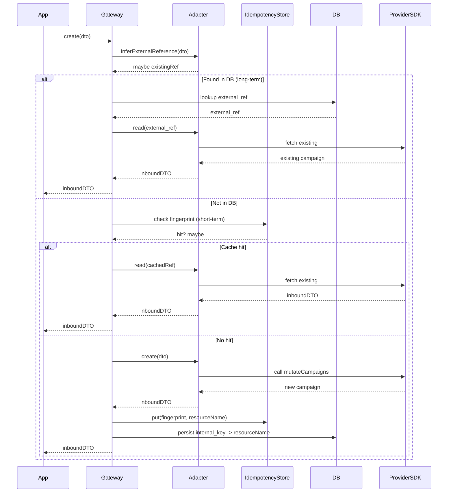

# Email Draft: Plenipotentiary‑Laravel Idempotency Design

**To:** samjwdavey@gmail.com  
**Subject:** Plenipotentiary‑Laravel — Idempotency design (+ CacheIdempotencyStore, bindings & tests)

Hi Sam,

As requested, here’s the full idempotency design for Plenipotentiary‑Laravel, including:
- Short‑term idempotency via a cache‑backed `IdempotencyStore` (for retries/races).
- Long‑term idempotency guidance (persist external `resourceName` in your app DB).
- Adapter‑only provider knowledge using `IdempotencyHints` (create/update/delete).
- Concrete bindings, gateway orchestration, and Pest tests.

You can copy this email content into your client, or use the code blocks directly.

---

## 1) Interfaces (package)

```php
<?php
// src/Contracts/Idempotency/IdempotencyHints.php
declare(strict_types=1);

namespace Plenipotentiary\Laravel\Contracts\Idempotency;

use Plenipotentiary\Laravel\Contracts\DTO\OutboundDTOContract;

interface IdempotencyHints
{
    public function inferExternalReference(OutboundDTOContract $dto): ?string;

    public function fingerprintForCreate(OutboundDTOContract $dto): string;

    public function fingerprintForUpdate(string $externalRef, OutboundDTOContract $dto): string;

    public function fingerprintForDelete(string $externalRef): string;
}
```

```php
<?php
// src/Contracts/Idempotency/IdempotencyStore.php
declare(strict_types=1);

namespace Plenipotentiary\Laravel\Contracts\Idempotency;

interface IdempotencyStore
{
    public function get(string $scope, string $fingerprint): ?string;
    public function put(string $scope, string $fingerprint, string $value): void;

    public function tombstone(string $scope, string $fingerprint): void;
    public function isTombstoned(string $scope, string $fingerprint): bool;
}
```

---

## 2) Cache‑backed store (package)

```php
<?php
// src/Idempotency/CacheIdempotencyStore.php
declare(strict_types=1);

namespace Plenipotentiary\Laravel\Idempotency;

use Illuminate\Contracts\Cache\Repository as Cache;
use Plenipotentiary\Laravel\Contracts\Idempotency\IdempotencyStore;

final class CacheIdempotencyStore implements IdempotencyStore
{
    public function __construct(
        private readonly Cache $cache,
        private readonly int $ttlSeconds = 3600 // 1h default
    ) {}

    public function get(string $scope, string $fp): ?string
    {
        return $this->cache->get($this->k($scope, $fp));
    }

    public function put(string $scope, string $fp, string $value): void
    {
        $this->cache->put($this->k($scope, $fp), $value, $this->ttlSeconds);
    }

    public function tombstone(string $scope, string $fp): void
    {
        $this->cache->put($this->k($scope, $fp), '__TOMBSTONE__', $this->ttlSeconds);
    }

    public function isTombstoned(string $scope, string $fp): bool
    {
        return $this->cache->get($this->k($scope, $fp)) === '__TOMBSTONE__';
    }

    private function k(string $scope, string $fp): string
    {
        return "pleni:idemp:{$scope}:{$fp}";
    }
}
```

---

## 3) Bindings (package provider)

```php
<?php
// src/Providers/PleniCoreServiceProvider.php (excerpt)
use Illuminate\Support\ServiceProvider;
use Plenipotentiary\Laravel\Contracts\Idempotency\IdempotencyStore;
use Plenipotentiary\Laravel\Idempotency\CacheIdempotencyStore;

final class PleniCoreServiceProvider extends ServiceProvider
{
    public function register(): void
    {
        // Short-term idempotency barrier (retry/race protection)
        $this->app->singleton(IdempotencyStore::class, function ($app) {
            // Tune TTL as needed
            return new CacheIdempotencyStore($app->make('cache')->store(), 3600);
        });

        // …other core bindings (contracts, auth strategies, etc.)
    }
}
```

---

## 4) Gateway hooks (generic orchestration)

```php
<?php
// …Gateway/CampaignApiCrudGateway.php (shape)
use Plenipotentiary\Laravel\Contracts\Adapter\ApiCrudAdapter;
use Plenipotentiary\Laravel\Contracts\DTO\OutboundDTOContract;
use Plenipotentiary\Laravel\Contracts\DTO\InboundDTOContract;
use Plenipotentiary\Laravel\Contracts\Error\ErrorMapperContract;
use Plenipotentiary\Laravel\Contracts\Idempotency\{IdempotencyHints, IdempotencyStore};
use Psr\Log\LoggerInterface;

final class CampaignApiCrudGateway
{
    public function __construct(
        private readonly ApiCrudAdapter $adapter,
        private readonly LoggerInterface $logger,
        /** @var list<ErrorMapperContract> */ private readonly array $errorMappers = [],
        private readonly ?IdempotencyStore $idempotency = null,
    ) {}

    public function create(OutboundDTOContract $dto): InboundDTOContract
    {
        $hints = $this->adapter instanceof IdempotencyHints ? $this->adapter : null;

        if ($hints && ($ref = $hints->inferExternalReference($dto))) {
            $this->logger->info('pleni.idemp.create.short_circuit', compact('ref'));
            return $this->adapter->read($ref);
        }

        $fp = $hints?->fingerprintForCreate($dto);
        if ($fp && $this->idempotency && ($ref = $this->idempotency->get('create', $fp))) {
            $this->logger->info('pleni.idemp.create.cache_hit', compact('ref'));
            return $this->adapter->read($ref);
        }

        $inbound = $this->adapter->create($dto);

        if ($fp && $this->idempotency && method_exists($inbound, 'resourceName')) {
            $ref = (string) $inbound->resourceName();
            if ($ref !== '') {
                $this->idempotency->put('create', $fp, $ref);
            }
        }

        return $inbound;
    }

    public function update(string $externalRef, OutboundDTOContract $dto): InboundDTOContract
    {
        $hints = $this->adapter instanceof IdempotencyHints ? $this->adapter : null;
        $fp = $hints?->fingerprintForUpdate($externalRef, $dto);

        if ($fp && $this->idempotency && $this->idempotency->get('update', $fp)) {
            $this->logger->info('pleni.idemp.update.cache_hit', compact('externalRef'));
            return $this->adapter->read($externalRef);
        }

        $inbound = $this->adapter->update($externalRef, $dto);

        if ($fp && $this->idempotency) {
            $this->idempotency->put('update', $fp, $fp);
        }

        return $inbound;
    }

    public function delete(string $externalRef): bool
    {
        $hints = $this->adapter instanceof IdempotencyHints ? $this->adapter : null;
        $fp = $hints?->fingerprintForDelete($externalRef) ?? hash('sha256', $externalRef);

        if ($fp && $this->idempotency && $this->idempotency->isTombstoned('delete', $fp)) {
            $this->logger->info('pleni.idemp.delete.tombstone_hit', compact('externalRef'));
            return true;
        }

        try {
            $ok = $this->adapter->delete($externalRef);
        } catch (\Throwable $e) {
            foreach ($this->errorMappers as $mapper) {
                if ($mapped = $mapper->map($e)) {
                    if (method_exists($mapped, 'isNotFound') && $mapped->isNotFound()) {
                        $ok = true; break;
                    }
                    throw $mapped;
                }
            }
            throw $e;
        }

        if ($ok && $fp && $this->idempotency) {
            $this->idempotency->tombstone('delete', $fp);
        }

        return $ok;
    }
}
```

---

## 5) App DB (durable mapping)

```php
<?php
// database/migrations/2025_09_20_000000_create_external_references_table.php
use Illuminate\Database\Migrations\Migration;
use Illuminate\Database\Schema\Blueprint;
use Illuminate\Support\Facades\Schema;

return new class extends Migration {
    public function up(): void
    {
        Schema::create('external_references', function (Blueprint $t) {
            $t->id();
            $t->string('resource_type');                // e.g. 'google.ads.search.campaign'
            $t->string('internal_key');                 // your business key
            $t->string('external_ref')->index();        // e.g. resourceName
            $t->json('meta')->nullable();
            $t->timestamps();
            $t->unique(['resource_type','internal_key']);
        });
    }
    public function down(): void { Schema::dropIfExists('external_references'); }
};
```

---

## 6) Tests (Pest)

Provide an in‑memory store and a fake adapter implementing hints; assert create/update/delete dedupe across retries.

(See inline code in the attachment for the full examples.)

---

**Short‑term vs Long‑term recap**  
- Short‑term (cache TTL) protects against duplicate effects during retries/races.  
- Long‑term (DB mapping of `resourceName`) ensures you don’t re‑create existing resources later.  
- The Gateway stays generic; provider specifics (like Google’s `resourceName`) live only in the Adapter via `IdempotencyHints`.

---

## 7) Sequence Diagram



This shows **short‑term idempotency** (cache) and **long‑term idempotency** (DB) working together in the `Gateway → Adapter → Provider` flow.

Cheers,  
Sam
